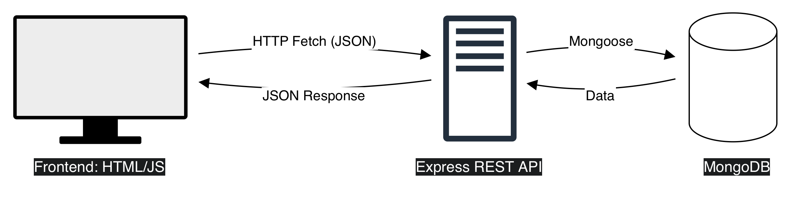

# GlowCare — NoSQL (MongoDB) Final Project

## Project Overview
GlowCare is a web application for skincare product discovery. Users register/login, complete a skin quiz, receive personalized product recommendations, save items to wishlist, and place orders through checkout.

## Tech Stack
- **Backend:** Node.js, Express
- **Database:** MongoDB (Mongoose)
- **Auth:** JWT + bcrypt
- **Frontend:** HTML + Bootstrap + Vanilla JS (fetch API)

## Features
- User registration and login (JWT)
- Profile page (view + update username)
- Skin quiz saved as **embedded document** in User
- Personalized recommendations using **aggregation pipeline**
- Product catalog with search, filters, pagination (text index)
- Wishlist using **advanced updates** ($addToSet / $pull)
- Cart (localStorage) + checkout → creates orders and updates stock using **$inc**
- Admin role can manage products and view analytics endpoints

## Project Structure
```
final
├── server.js              # Entry point of the application
├── .env                   # Environment variables (DB URI, Secret keys)
├── .gitignore             # Files and folders to ignore in Git
├── package.json           # Project dependencies and scripts
└── src/                   # Source code
    ├── db.js              # MongoDB connection setup
    ├── middleware.js      # Authentication and validation middlewares
    ├── models.js          # Mongoose schemas and models
    └── routes/            # API Route handlers
        ├── auth.js        # Routes for login/registration
        ├── user.js        # User profile and data management
        ├── products.js    # Product catalog logic
        └── orders.js      # Order processing logic
```

## System Architecture
Flow: Frontend (HTML/JS) → HTTP requests (fetch) → Express REST API → MongoDB (Mongoose) → JSON response → UI renders data.

Frontend - client side. Frontend is built with HTML + Bootstrap and communicates with the backend using fetch requests.  

Express and MongoDB - server side. Backend is an Express REST API that processes requests, validates data, applies business logic, queries MongoDB using Mongoose, and returns JSON responses.

## Database Design (Schemas)

### 1. User Collection (users)
Key fields:
- `email` (String, unique)
- `password` (String, hashed)
- `role` (String: user/admin)
- `username` (String)
- `quizProfile` (Embedded document)
  - `skinType` (String)
  - `concerns` ([String])
  - `preferences` ([String])
  - `completedAt` (Date)
- `wishlist` ([ObjectId] ref Product)
- timestamps: `createdAt`, `updatedAt`

Data model choice:
- quizProfile is embedded because it belongs only to the user and is always accessed with the user.
- wishlist references products because products are shared between many users.

### 2. Product Collection (products)
Key fields:
- `title`, `brand`, `category`
- `price`, `stock`
- recommendation tags: `skinTypes`, `concerns`, `qualities`
- `soldCount`
- timestamps

### 3. Order Collection (orders)
Key fields:
- `userId` (ref User)
- `items[]` (embedded)
  - `productId` (ref Product)
  - `quantity`
  - `price`
- `totalPrice`
- `status` (pending/paid/shipped/cancelled)
- timestamps

Embedded choice:
- order items are embedded because they are part of a single order document and are always retrieved together.

## REST API Design
The API follows REST principles:
- `/api/auth` for authentication
- `/api/user` for profile, quiz, wishlist
- `/api/products` for product catalog and admin CRUD
- `/api/orders` for checkout and order history

Auth:
- POST /api/auth/register
- POST /api/auth/login

User / Profile / Quiz / Wishlist:
- GET /api/user/profile
- PUT /api/user/profile
- GET /api/user/wishlist
- POST /api/user/wishlist/:productId
- DELETE /api/user/wishlist/:productId
- POST /api/user/quiz
- GET /api/user/quiz/recommendations (aggregation)
  
Products (Catalog):
- GET /api/products (filters: search, category, minPrice, maxPrice, page, limit)
- GET /api/products/:id
- POST /api/products (admin only)
- PUT /api/products/:id (admin only)
- DELETE /api/products/:id (admin only)

Orders
- POST /api/orders/checkout (creates order + updates product stock via $inc)
- GET /api/orders/my
- GET /api/orders/stats/top-selling (admin, aggregation)
- GET /api/orders/stats/revenue-by-category (admin, aggregation)

Endpoints include:
- Full CRUD on products
- Multiple user endpoints (profile, wishlist, quiz)
- Advanced updates ($addToSet, $pull, $inc, $set)
- Aggregation endpoints for recommendations and analytics
  
## Advanced MongoDB Operations

### 1. Advanced Updates
- Wishlist:
  - Add: `$addToSet` to avoid duplicates
  - Remove: `$pull`
- Quiz:
  - Update embedded quizProfile: `$set`
- Checkout (stock + soldCount):
  - `$inc: { stock: -qty, soldCount: qty }`

### 2. Aggregation Framework

#### A) Recommendations based on quiz (User)
Pipeline stages:
- `$match` products by skin type and at least one concern
- `$addFields` calculates match scores using `$setIntersection` and `$size`
- `$sort` by score and popularity
- `$limit` top results

This returns the most relevant products for the user.

#### B) Top Selling products (Admin)
Pipeline:
- `$unwind` items
- `$group` by productId to sum quantity and revenue
- `$sort` and `$limit`

#### C) Revenue by Category (Admin)
Pipeline:
- `$unwind` items
- `$lookup` products
- `$group` by category with revenue
- `$project` clean output
- `$sort`

## Indexing and Optimization Strategy
Indexes used:
- Products compound index `{ category: 1, price: 1 }` for catalog filtering and sorting.
- Products text index for full-text search across title/brand/category/qualities.
- Orders index `{ userId: 1, createdAt: -1 }` for fast “my orders” queries.

These indexes reduce query time for common UI actions: browsing catalog, searching, and viewing order history.

## Authentication and Authorization
- JWT is issued during login/register and stored on frontend (localStorage).
- Protected routes require `Authorization: Bearer <token>`.
- Middleware verifies JWT and sets `req.user`.
- Admin-only routes use role checks (`requireRole("admin")`).

## Frontend Pages
Implemented pages:
1) Auth (login/register)
2) Profile
3) Home (recommendations + new arrivals)
4) Catalog (filters/search/pagination)
5) Wishlist
6) Cart + Checkout (+ My Orders)
7) Quiz

## Team Contribution
Diana:
- Auth endpoints integration (login/register)
- User model and user routes: profile, quiz, wishlist
- Quiz recommendations aggregation
- Frontend pages: Auth, Profile, Quiz, Wishlist, Home integration

Akerke:
- Product and Order schemas + indexes
- Product CRUD endpoints + search/filter/pagination
- Checkout logic (advanced $inc updates)
- Admin aggregation endpoints: top-selling and revenue-by-category

## Run the project
  1. Clone the repository
  2. Install dependencies: 

    npm install
  3. Create .env file and add:
   
    PORT=3000
    MONGO_URI=our_mongodb_connection_string
    JWT_SECRET=our_secret_key
  4. Start the server:
   
    npm run dev


## Conclusion
GlowCare meets the course requirements: multi-collection MongoDB database, embedded and referenced models, REST API with CRUD, advanced update operations, aggregation pipelines with business meaning, indexing strategy, authentication/authorization, and a working frontend with at least 6 pages.