# GlowCare — Skincare Recommendation Web Application

## Project Repository
https://github.com/AkerkeTastemir/glowcare-final.git

## Project Link
https://glowcare-final.onrender.com

## Project Overview
GlowCare is a web application for skincare product discovery. Users register/login, complete a skin quiz, receive personalized product recommendations, save items to wishlist, and place orders through checkout.

## Features
- User registration and login using JWT authentication
- Profile page with ability to update username
- Skin quiz stored as embedded document in User
- Personalized recommendations using MongoDB aggregation pipeline
- Product catalog with search, filters, pagination, and text index
- Wishlist implemented using `$addToSet` and `$pull`
- Cart with checkout that updates stock using `$inc`
- Admin role with product management and analytics endpoints
- SMTP email notifications (registration + discount notifications)

## Technology Stack
- **Backend:** Node.js, Express
- **Database:** MongoDB (Mongoose)
- **Authentication:** JWT + bcrypt
- **Frontend:** HTML, Bootstrap, Vanilla JavaScript (Fetch API)
- **Email:** Nodemailer + external SMTP provider (API keys in `.env`)

## System Architecture
Flow: Frontend (HTML/JS) → HTTP requests (fetch) → Express REST API → MongoDB (Mongoose) → JSON response → UI renders data.

Frontend - client side. Frontend is built with HTML + Bootstrap and communicates with the backend using fetch requests.  

Express and MongoDB - server side. Backend is an Express REST API that processes requests, validates data, applies business logic, queries MongoDB using Mongoose, and returns JSON responses.
**Data Flow:** Frontend → Express REST API → MongoDB → JSON Response → UI Rendering

## Project Structure
```
final
├── server.js                 # Application entry point (Express server)
├── .env                      # Environment variables (MongoDB URI, JWT secret, SMTP keys)
├── .gitignore                # Git ignored files
├── package.json              # Dependencies and scripts
├── package-lock.json
├── README.md                 # Project documentation
│
├── screenshots/              # Screenshots for report and README
│   ├── flow_diagram.png              # Flow diagram
│   ├── login.png              # Login page
│   ├── register.png              # Register page
│   ├── profile.png           # User profile page
│   ├── home.png              # Home page (recommendations, hits)
│   ├── catalog.png           # Product catalog with filters
│   ├── wishlist.png          # Wishlist page
│   ├── cart.png              # Cart and checkout page
│   ├── skin_quiz.png              # Skin quiz page
│   ├── login_postman.png     # Postman: login endpoint
│   ├── recommendations_postman.png # Postman: recommendations endpoint
│   └── checkout_postman.png  # Postman: checkout endpoint
│
├── public/                   # Frontend 
│   ├── css/
│   │   └── app.css           # Global styles
│   │
│   ├── js/
│   │   ├── api.js            # API helper (fetch wrapper, JWT handling)
│   │   ├── auth.js           # Login & registration logic
│   │   ├── home.js           # Home page (recommendations, new products)
│   │   ├── catalog.js        # Product catalog, filters, admin actions
│   │   ├── wishlist.js       # Wishlist logic
│   │   ├── cart.js           # Cart and checkout logic
│   │   ├── profile.js        # User profile logic
│   │   ├── quiz.js           # Skin quiz logic
│   │   └── ui.js             # Shared UI helpers (navigation, formatting)
│   │
│   └── pages/
│       ├── auth.html         # Login & registration page
│       ├── home.html         # Home page
│       ├── catalog.html      # Product catalog page
│       ├── wishlist.html     # Wishlist page
│       ├── cart.html         # Cart & checkout page
│       ├── profile.html      # User profile page
│       └── quiz.html         # Skin quiz page
│
└── src/                      # Backend source code
    ├── db.js                 # MongoDB connection
    ├── models.js             # Mongoose schemas (User, Product, Order)
    ├── middleware.js         # JWT auth, RBAC, validation, error handler
    ├── mailer.js             # SMTP email configuration (Nodemailer)
    │
    └── routes/               # API routes
        ├── auth.js           # Authentication routes (register, login)
        ├── user.js           # User profile, quiz, wishlist
        ├── products.js       # Products CRUD + admin logic + price change notifications
        └── orders.js         # Orders, checkout, analytics (aggregations)
```

## Database Design
### User Collection (`users`)
- `email` 
- `password`
- `role` 
- `username` 
- `quizProfile` (Embedded document: `skinType`, `concerns`, `preferences`, `completedAt`)
- `wishlist` (Array of Product ObjectIds)
- `createdAt`, `updatedAt` (timestamps)

### Product Collection (`products`)
- `title`, `brand`, `category`
- `price`, `stock`
- `skinTypes`, `concerns`, `qualities`
- `soldCount`
- timestamps

### Order Collection (`orders`)
- `userId` (Reference to User)
- `items[]` (Embedded: `productId`, `quantity`, `price`)
- `totalPrice`
- `status`
- timestamps

## REST API
### Authentication (`/api/auth`)
- `POST /api/auth/register`
- `POST /api/auth/login`

### User (`/api/user`)
- `GET /api/user/profile`
- `PUT /api/user/profile`
- `GET /api/user/wishlist`
- `POST /api/user/wishlist/:productId`
- `DELETE /api/user/wishlist/:productId`
- `POST /api/user/quiz`
- `GET /api/user/quiz/recommendations` *(aggregation)*

### Products (`/api/products`)
- `GET /api/products` *(search/filters/pagination)*
- `GET /api/products/:id`
- `POST /api/products` *(admin only)*
- `PUT /api/products/:id` *(admin only)*
- `DELETE /api/products/:id` *(admin only)*

### Orders (`/api/orders`)
- `POST /api/orders/checkout` *(creates order + updates stock via `$inc`)*
- `GET /api/orders/my`
- `GET /api/orders/stats/top-selling` *(admin, aggregation)*
- `GET /api/orders/stats/revenue-by-category` *(admin, aggregation)*

## Advanced MongoDB Operations
### Advanced Updates
- Wishlist: `$addToSet`, `$pull`
- Quiz: `$set` embedded `quizProfile`
- Checkout: `$inc` (decrease stock, increase soldCount)

### Aggregation Framework
- Recommendations pipeline (multi-stage `$match`, `$addFields`, `$sort`, `$limit`)
- Admin analytics:
  - Top-selling products (`$unwind`, `$group`, `$sort`, `$limit`)
  - Revenue by category (`$lookup`, `$group`, `$project`, `$sort`)

## Authentication & Authorization
- JWT issued during login/register and stored in frontend (localStorage)
- Protected routes require header: `Authorization: Bearer <token>`
- `authJWT` middleware verifies JWT and sets `req.user`
- Admin-only routes use `requireRole("admin")`

## Frontend Pages
Implemented pages:
1) Auth (login/register)
2) Profile
3) Home (recommendations + new arrivals)
4) Catalog
5) Wishlist
6) Cart + Checkout
7) Quiz

## Frontend Demonstration
1. Authentication page (login and registration) :  The authentication page allows users to register and log in using JWT-based authentication. After successful login, the user is redirected to the profile page.
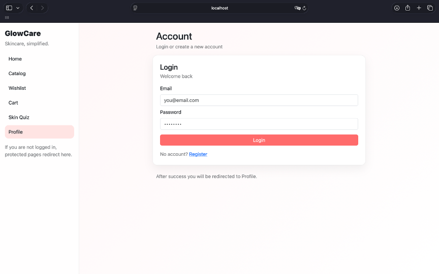
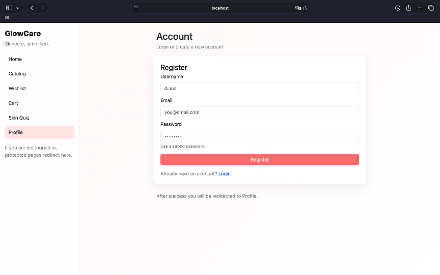
2. Profile Page: The profile page displays user information and allows updating profile data such as the username. The page is accessible only to authenticated users.
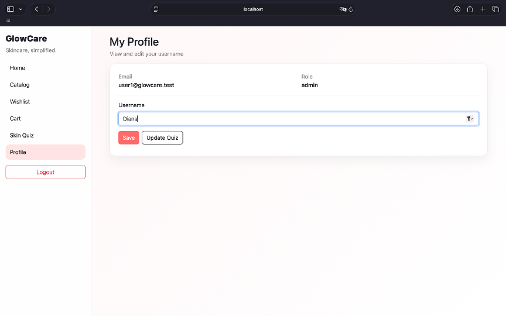
3. Home Page (Recommendations): The home page shows personalized product recommendations based on the completed skin quiz and highlights newly added products.
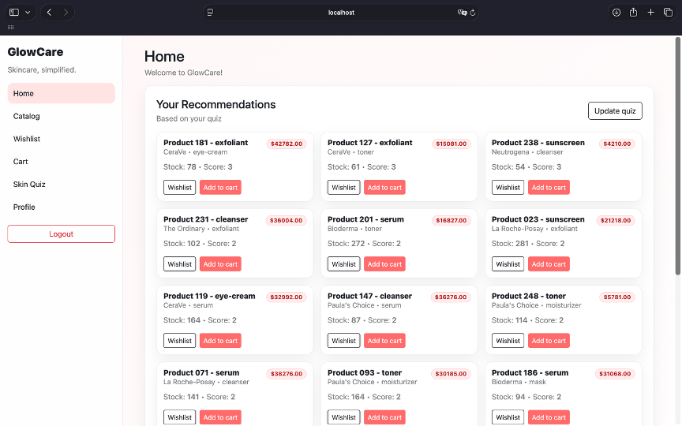
4.	Catalog Page: The catalog page displays all available products with support for search, category filtering, price filtering, pagination, and admin actions.
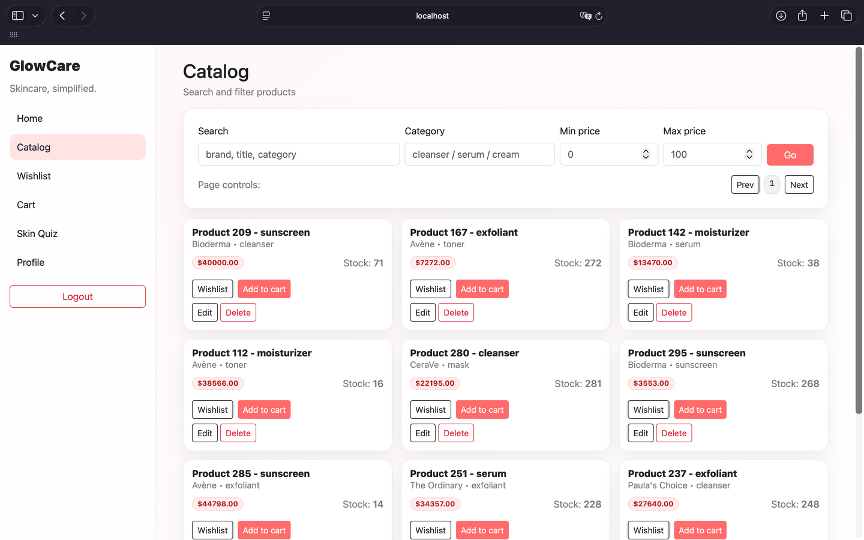
5.	Wishlist Page: The wishlist page allows users to view, add, and remove products saved to their wishlist.
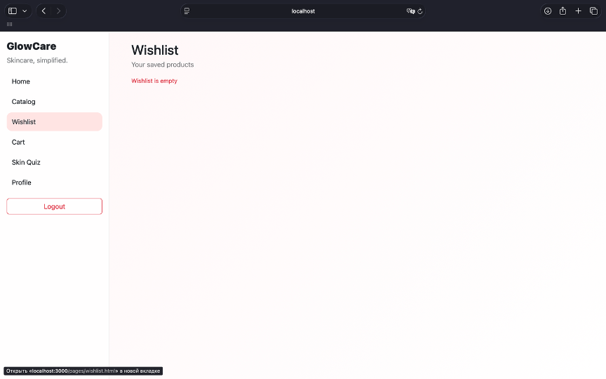
6.	Cart Page: The cart page displays selected products and allows users to place an order through the checkout process, which updates product stock and creates an order in the database.
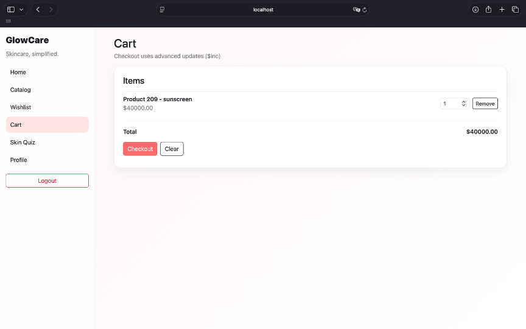
7.	Skin Quiz Page: The skin quiz page allows users to select skin type, concerns, and preferences, which are stored as an embedded document and used to generate personalized recommendations.
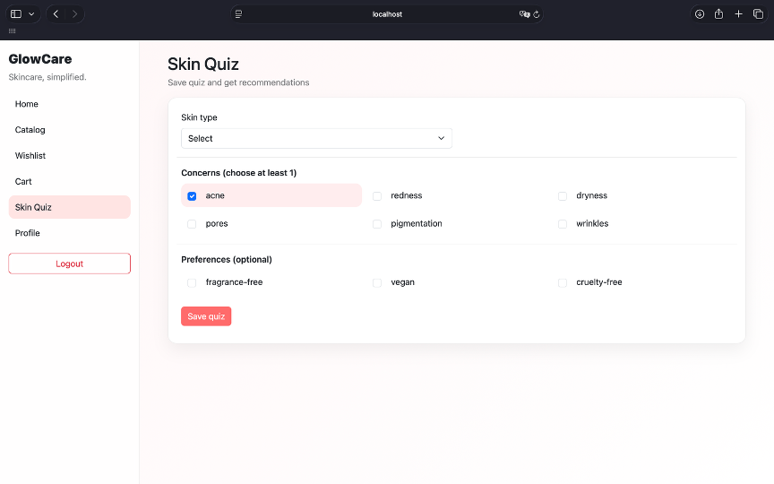

## Backend Demostration
1.	User login API request: Successful login request returning a JWT token used for authenticated requests.
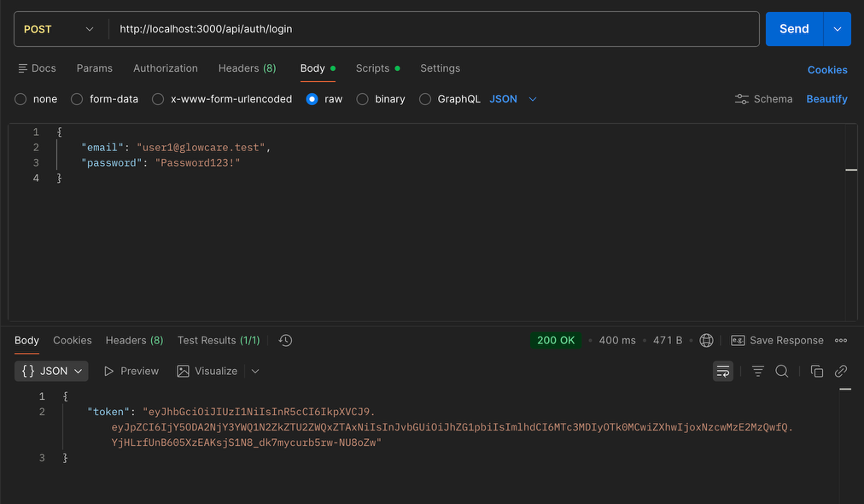
2.	Recommendations API response: Response from the aggregation-based recommendations endpoint returning personalized product data in JSON format.
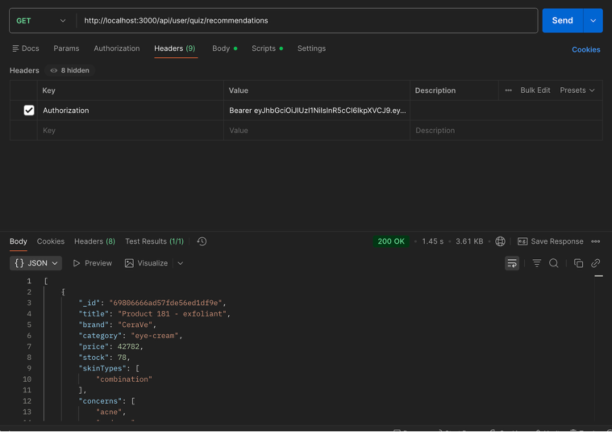
3.	Checkout API request: Checkout request creating a new order and updating product stock using advanced MongoDB update operators.
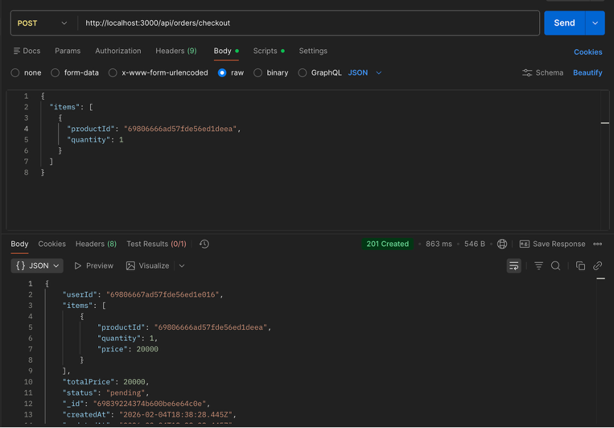

## Team Contribution
Diana:
- Auth endpoints integration (login/register)
- User model and user routes: profile, quiz, wishlist
- Quiz recommendations aggregation
- Frontend pages: Auth, Profile, Quiz, Wishlist

Akerke:
- Product and Order schemas + indexes
- Product CRUD endpoints + search/filter/pagination
- Checkout logic (advanced $inc updates)
- Admin aggregation endpoints: top-selling and revenue-by-category
- Frontend pages: Home, Catalog, Cart

## Run the project
  1. Clone the repository
  2. Install dependencies: 

    npm install
  3. Create .env file and add:
   
    PORT=3000
    MONGO_URI=our_mongodb_connection_string
    JWT_SECRET=our_secret_key
    SMTP_HOST=smtp_provider_host
    SMTP_PORT=587
    SMTP_USER=apikey
    SMTP_PASS=our_smtp_api_key
    SMTP_FROM=our_email@gmail.com
  4. Start the server:
   
    npm run dev


## Conclusion
GlowCare meets the course requirements: multi-collection MongoDB database, embedded and referenced models, REST API with CRUD, advanced update operations, aggregation pipelines with business meaning, indexing strategy, authentication/authorization, and a working frontend with at least 6 pages.